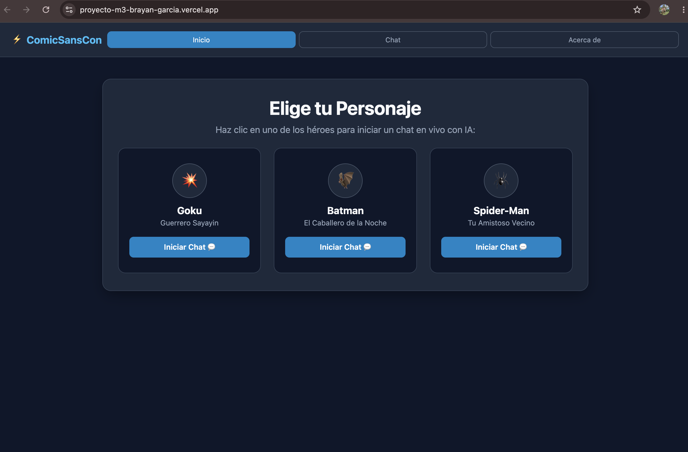
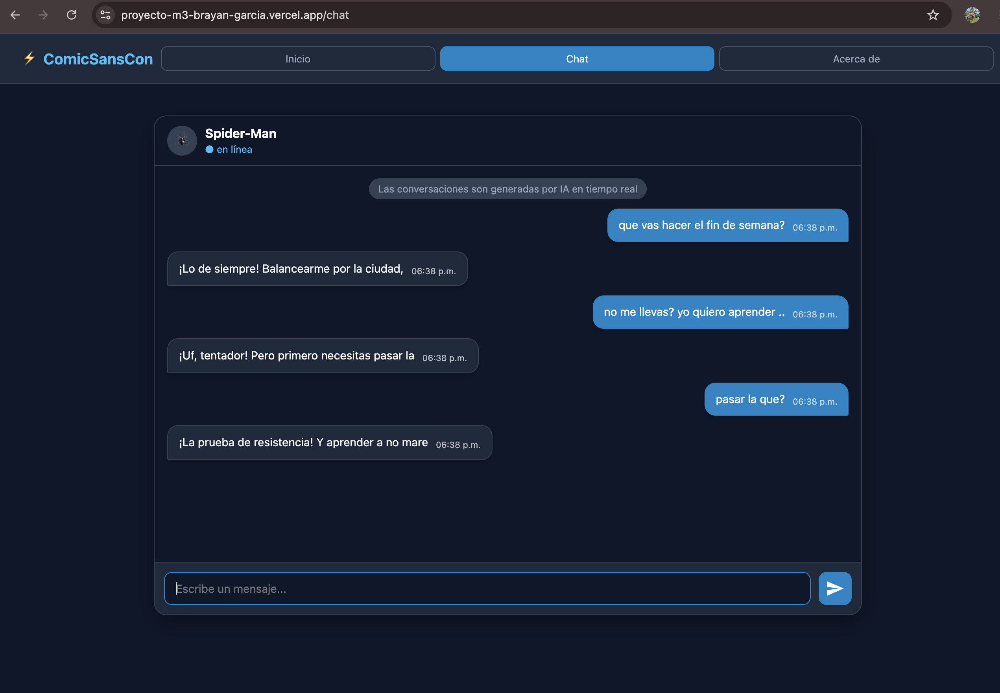
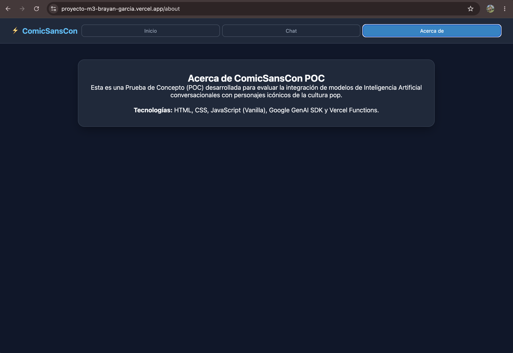
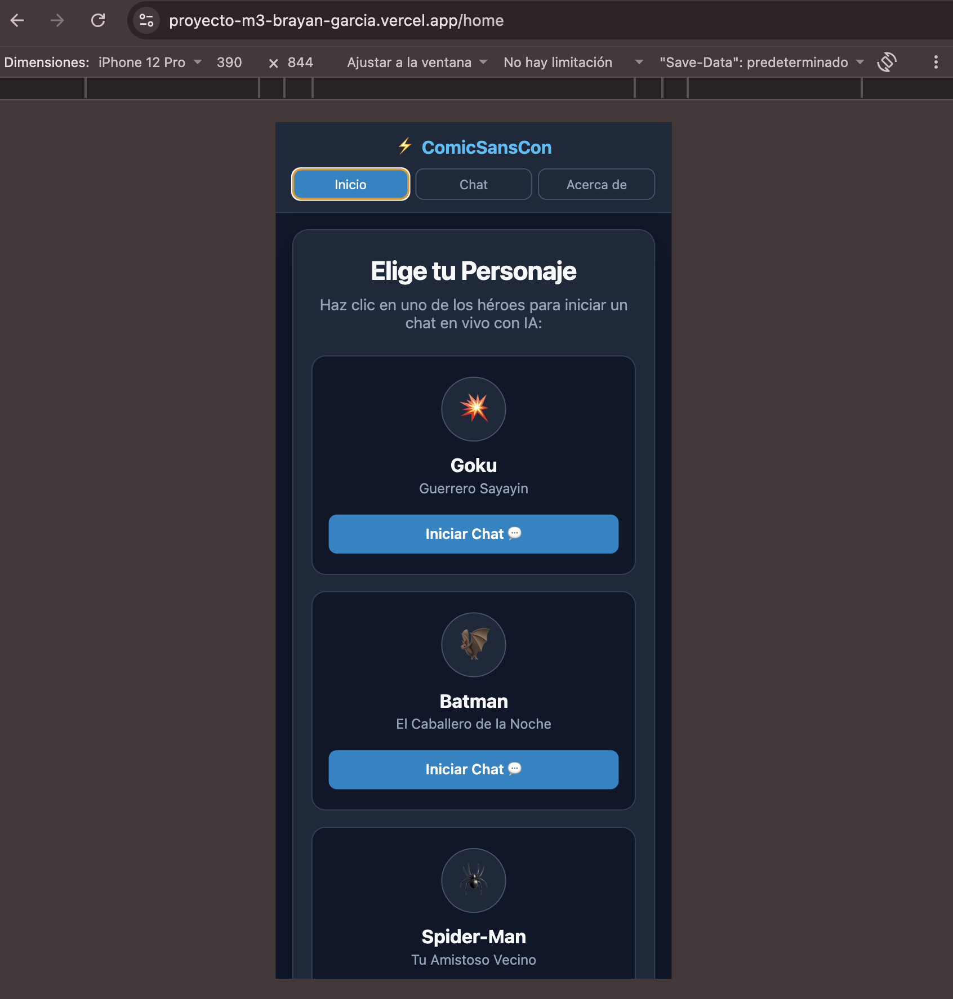
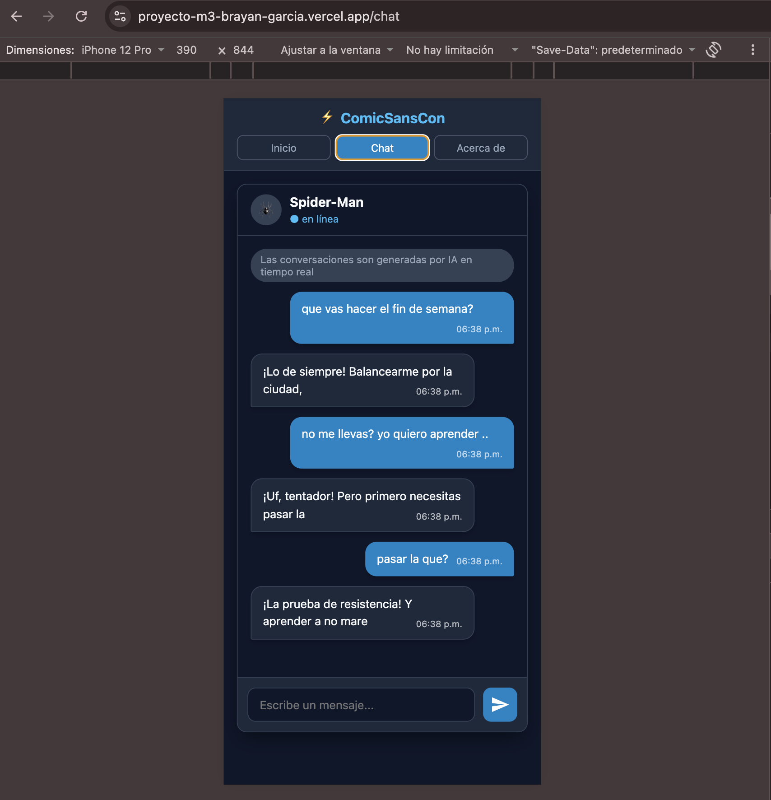
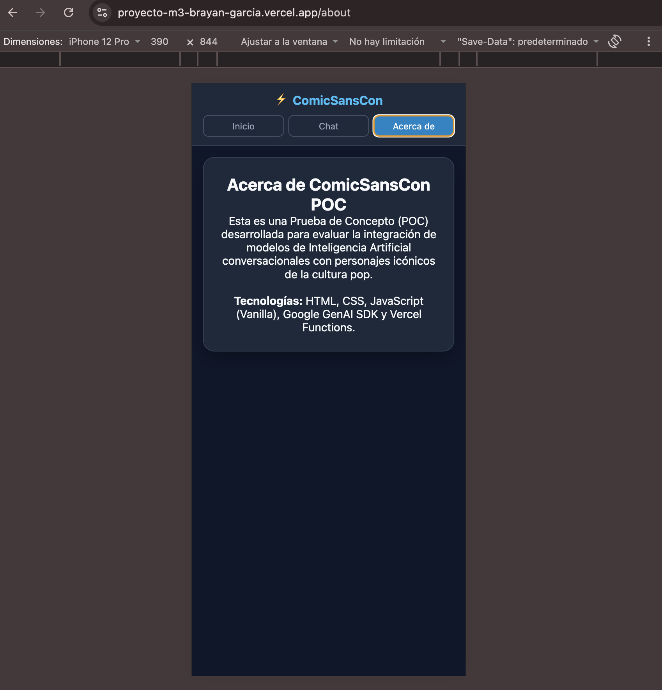

# ComicSansCon — Chatea con tu Personaje Favorito

Proyecto Integrador del Módulo 3 de SoyHenry. Single Page Application que permite chatear con personajes ficticios usando inteligencia artificial (Google Gemini), desarrollado por Bryan García para la agencia ficticia **ComicSansCon**.

## 1. Descripción del personaje elegido

El proyecto permite elegir entre **tres personajes** de la cultura pop, cada uno con su propia personalidad definida mediante un system prompt específico:

- **Goku** (Dragon Ball) — alegre, apasionado por entrenar y comer, siempre buscando volverse más fuerte.
- **Batman** (DC Comics) — serio, reservado, analítico y protector de Gotham.
- **Spider-Man** (Marvel) — divertido, carismático y bromista.

Cada personaje responde en español, manteniendo su tono característico, con respuestas cortas y apropiadas para una conversación de chat.

## 2. Capturas de pantalla

### Desktop

**Home — Selección de personaje**


**Chat — Conversación en curso**


**About — Información del proyecto**


### Mobile

**Home — Selección de personaje**


**Chat — Conversación en curso**


**About — Información del proyecto**


## 3. Aplicación desplegada

🔗 **URL pública:** [https://proyecto-m3-brayan-garcia.vercel.app](https://proyecto-m3-brayan-garcia.vercel.app)

## 4. Tecnologías utilizadas

- **HTML5 / CSS3** — interfaz responsive, mobile-first, con Flexbox y Grid.
- **JavaScript (Vanilla JS, módulos ES)** — SPA, routing, lógica de chat.
- **History API** (`pushState` / `popstate`) — navegación sin recargas.
- **Google Gemini (`@google/genai`)** — modelo `gemini-3.6-flash` para las respuestas de los personajes.
- **Vercel Serverless Functions** — proxy seguro entre el frontend y Gemini.
- **Vitest** — pruebas unitarias.
- **Vercel** — plataforma de despliegue.
- **Claude (Anthropic)** — apoyo de aprendizaje durante el desarrollo (ver sección 10).

## 5. Estructura del proyecto

```
ProyectoM3_BrayanGarcia/
├── api/
│   └── chat.js              → Vercel Function: proxy seguro hacia Gemini
├── capturas/                → Capturas de pantalla (1.png a 6.png: desktop y mobile)
├── public/
│   ├── index.html            → Estructura de la SPA (vistas Home, Chat, About)
│   ├── styles.css             → Estilos responsive (mobile-first, 2 breakpoints)
│   ├── app.js                  → Routing (History API) y lógica de la interfaz
│   ├── chat.js                  → Comunicación con la API (fetch)
│   └── utils.js                  → Funciones puras: validación, formateo, parseo
├── tests/
│   └── utils.test.js               → 4 tests unitarios con Vitest
├── vercel.json                       → outputDirectory: "public" + rewrites para el routing SPA
├── .env                                → Variables de entorno (no se sube a Git)
├── .env.example                         → Plantilla de variables de entorno
├── .gitignore
├── package.json
└── README.md
```

## 6. Funcionalidades

- **Selección de personaje** desde una galería visual de tarjetas.
- **Chat en tiempo real** con diferenciación visual clara entre mensajes del usuario y del personaje.
- **Historial completo enviado en cada request** — el personaje mantiene contexto de toda la conversación, no solo del último mensaje.
- **Indicador de "Escribiendo..."** mientras se espera la respuesta de la IA.
- **Manejo de errores elegante** — si la API falla, se muestra un mensaje claro dentro del propio chat.
- **Reintento automático** ante errores de alta demanda (503) del modelo, antes de mostrar el error al usuario.
- **Timestamps** en cada mensaje y **scroll automático** al último mensaje.
- **Routing SPA real** con History API: `/home`, `/chat`, `/about` cambian la URL sin recargar la página, y los botones back/forward del navegador funcionan correctamente.
- **Diseño responsive mobile-first**, con breakpoints para tablet (600px) y desktop (1024px).

## 7. Requisitos y pasos para ejecutar localmente

### Requisitos previos
- Node.js instalado (v18 o superior).
- Vercel CLI: `npm install -g vercel`
- Una API Key de Google Gemini, generada en [Google AI Studio](https://aistudio.google.com/api-keys).

### Pasos

1. Clona el repositorio:
   ```bash
   git clone https://github.com/BSGarcia01/ProyectoM3_BrayanGarcia.git
   cd ProyectoM3_BrayanGarcia
   ```

2. Instala las dependencias:
   ```bash
   npm install
   ```

3. Crea tu archivo `.env` a partir de la plantilla:
   ```bash
   cp .env.example .env
   ```
   Y agrega tu propia API key:
   ```
   GEMINI_API_KEY=tu_api_key_de_gemini
   ```

4. Ejecuta el proyecto con Vercel CLI (necesario para simular correctamente las Serverless Functions en local):
   ```bash
   vercel dev
   ```
   La aplicación quedará disponible en `http://localhost:3000`.

## 8. Cómo ejecutar los tests

El proyecto incluye 4 tests unitarios con **Vitest**, enfocados en las funciones puras de `utils.js` (validación de mensajes, transformación del historial al formato de Gemini, y parseo de respuestas):

```bash
npm test
```

Salida esperada:
```
✓ tests/utils.test.js (4)
  ✓ validarMensaje (2)
  ✓ construirHistorialParaGemini (1)
  ✓ parseRespuestaGemini (1)

Tests  4 passed (4)
```

## 9. Cómo desplegar a Vercel

1. Conecta el repositorio de GitHub a un nuevo proyecto en [vercel.com](https://vercel.com) (Import Git Repository).
2. En **Settings → Build and Deployment**, asegúrate de que el **Framework Preset** esté configurado como **"Other"**.
3. En **Settings → Environment Variables**, agrega:
   - **Key:** `GEMINI_API_KEY`
   - **Value:** tu API key real
   - Marca los 3 entornos: Production, Preview y Development.
4. Despliega desde la terminal:
   ```bash
   vercel --prod
   ```
5. Vercel detecta automáticamente la carpeta `api/` como Serverless Function. El archivo `vercel.json` define `"outputDirectory": "public"` (para que el contenido de esa carpeta se sirva desde la raíz del sitio) y un rewrite que redirige todas las rutas no-API hacia `index.html`, permitiendo que el routing SPA funcione también en producción (incluyendo al recargar directamente en `/chat` o `/about`).

## 10. Uso de la IA

Durante el desarrollo utilicé Claude (Anthropic) como tutor de aprendizaje: la dinámica consistió en que yo escribía y decidía el código, mientras Claude explicaba conceptos, revisaba errores y guiaba el razonamiento paso a paso, dando código ya armado solo en piezas repetitivas donde el patrón ya estaba dominado o cuando el tiempo era limitado.

Algunos ejemplos de cómo se usó la IA en momentos clave del desarrollo:

- Al recibir el feedback de una entrega previa desaprobada, compartí la retroalimentación y la rúbrica de evaluación para identificar, categoría por categoría, qué requisitos técnicos faltaban (routing SPA real, historial completo a Gemini, arquitectura coherente, testing, CSS mobile-first).
- Al diagnosticar por qué la conexión con Gemini fallaba en producción, se revisaron los logs de Vercel en conjunto para identificar errores concretos (variable de entorno faltante, nombre de modelo mal escrito, un parámetro de configuración no soportado por el modelo).
- Al reestructurar el proyecto (eliminando una arquitectura previa basada en Express y SQLite), se explicó por qué una arquitectura única y simple, alineada a lo que pedía la consigna, era preferible a mantener dos enfoques a medio terminar.
- Al escribir el CSS, se explicó la diferencia conceptual entre un enfoque "desktop-first" (el que tenía originalmente) y uno genuinamente "mobile-first", reescribiendo los estilos para que el diseño base fuera el de celular, y los breakpoints agregaran mejoras progresivas hacia tablet y desktop.

## 11. Repositorio

- **Repositorio:** [https://github.com/BSGarcia01/ProyectoM3_BrayanGarcia](https://github.com/BSGarcia01/ProyectoM3_BrayanGarcia)
- **Demo desplegada:** [https://proyecto-m3-brayan-garcia.vercel.app](https://proyecto-m3-brayan-garcia.vercel.app)

## Autor

Bryan García

Redes sociales: @stivengarciac